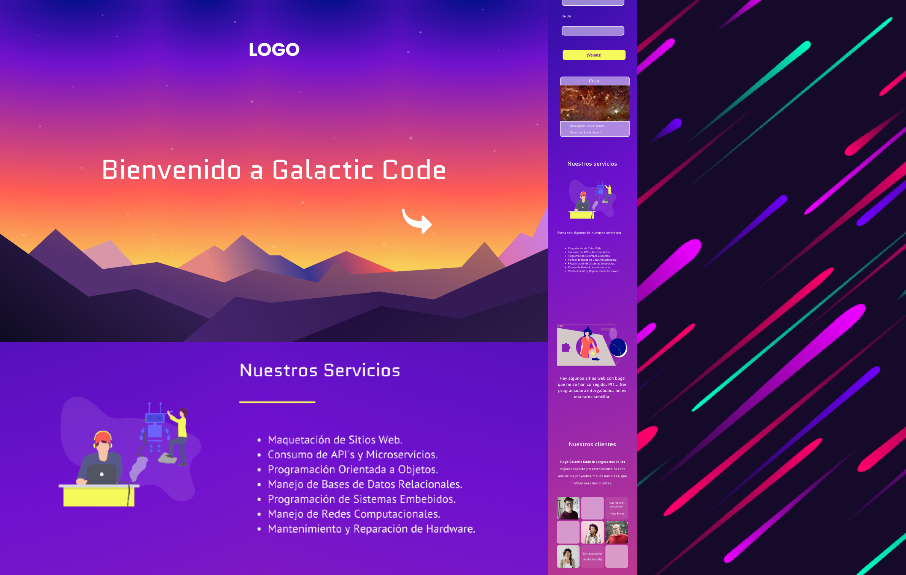

# projecto-inicial-generation

## Recursos de Apoyo

1. En esta API puedes traer una foto y su información relacionada. Es un API pensada en obtener un foto por cada día del año. Inicio a mediados de los años 90, por lo que la fecha mínima para hacer consultas es 1995-06-16.

    [Astronomy Picture of the Day (APOD)](https://apod.nasa.gov/apod/astropix.html)

2. Documentación para implementar o contribuir en APOD. Así como para entender los parámetros de funcionamiento.

    [Astronomy Picture of the Day (APOD) microservice (Docs)](https://github.com/nasa/apod-api)

3. Documentación de Bootstrap v.4.6.

    [Bootstrap v.4.6 (Docs)](https://getbootstrap.com/docs/4.6/getting-started/introduction/)

4. Documentación de Animate.css. Es una librería de CSS para hacer anmiaciones.

    [Animate.css](https://animate.style/)

## Mockup UX

</img>
    
Para ver el diseño completo consulta el siguiente enlace: [UX en Figma](https://www.figma.com/file/vlOefJxyNJtI1snj84SOO4/projecto-inicial?node-id=16%3A47)

## Requerimientos

- Frontend en HTML5, CSS3 y JS.
- Debe incluir al menos una sección construida con Bootstrap.
- Debe incluir al menos un sección contruida con CSS puro.
- Debe contener al menos un carrusel.
- Debe incluir un loader.
- Debe consumir al menos una API pública.
- Debe contener al menos un formulario.
- Debe incluir un archivo para su descarga.
- Debe ser responsive.

## Tiempo de entrega

El proyecto tendrá una duración de 2 semanas.

|Fecha |Actividad| Descripción
--- | --- | ---
|Lunes 13 |Inicio de Proyecto |Entrega de repositorio|
|Viernes 17 |Primera revisión |Diseño + Maquetación + Revisión de repositorio|
|Lunes 20 |Segunda revisión |Revisión código + Funcionalidad|
|Miércoles 22 |Tercera revisión |Revisión código + Funcionalidad|
|Viernes 24 |Entrega |Entrega de repositorio + Link de Consulta|

## Entregables

1. Diseño de Mockup.
2. Página home.
    1. Datos de Contacto.
    2. Descripción personal.
    3. Formulario.
    4. Portafolio (Opcional).
3. Respositorio.
4. Despliegue en GitHub Pages.
